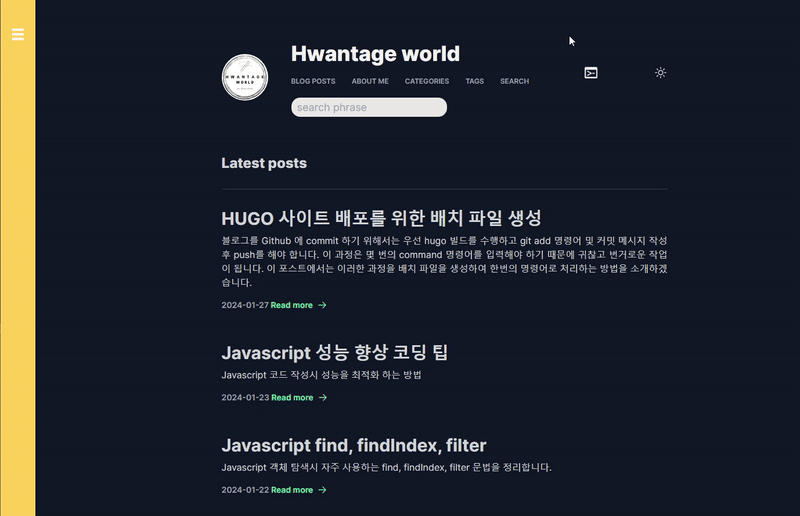

# Hwantage World Theme

Based on **Lowkey Hugo theme**

**Lowkey** is a simple and modern theme that is inspired by [Adam Wathan's Blog](https://adamwathan.me/). It is built using Tailwind CSS, which allows for easy customization. The theme features a minimalistic and streamlined layout, with a focus on readability and ease of use. With its lightweight code and fast loading times, Lowkey Hugo theme is a great choice for those looking to create a personal blog and user-friendly blog.

[See more](https://github.com/nixentric/Lowkey-Hugo-Theme)

## Custom list

* 왼쪽 메뉴 기능 추가
* fake 터미널 기능 추가 (상단 아이콘 클릭)
* 검색 기능 추가 (한글 초성 검색 지원, 순간 검색 지원)
* 코드 Copy 기능 추가
* utteranc 댓글 기능 추가
* 포스트 하단에 이전글, 다음글 기능 추가
* 연관 포스트 기능 추가 (See Also)
* 메뉴 커스텀
* favicon 추가
* index.json 생성 기능 추가
* 구글 애널리틱스 코드 삽입
* robots.txt 내용 변경
* 포스트 리스트에서 포스트 제목 크기 조정
* 포스트 리스트에서 날짜와 Read more 한줄로 표기되도록 변경
* 날짜 출력 포맷 변경 (2024-01-27)

## Blog link

[https://hwantage.github.io](https://hwantage.github.io)

